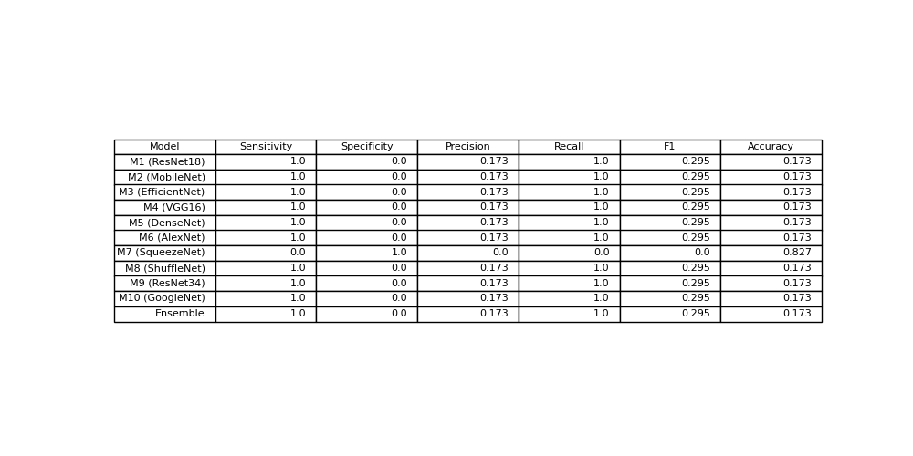

# Deep Fake Detection using Pre-Trained Models

## Overview
This project focuses on detecting deepfake images using multiple pretrained convolutional neural network (CNN) models. Each model is fine-tuned on a dataset containing real and fake images.

The main objective is to compare different pretrained architectures and improve performance using an ensemble approach.

## Dataset
The dataset contains two classes:

- Real images
- Fake images

## Models Used
The following pretrained models (from torchvision) are used:

- M1: ResNet18  
- M2: MobileNetV2  
- M3: EfficientNet-B0  
- M4: VGG16  
- M5: DenseNet121  
- M6: AlexNet  
- M7: SqueezeNet  
- M8: ShuffleNet  
- M9: ResNet34  
- M10: GoogLeNet  

All models are initialized with pretrained weights and fine-tuned on the dataset.

## Ensemble Learning (Main Contribution)
An ensemble model is implemented using majority voting:

- Each model predicts whether an image is real or fake  
- Final prediction is determined by the most frequent prediction across all models  

This improves stability, robustness, and overall performance.

## Evaluation Metrics
Each model (and ensemble) is evaluated using:

- Sensitivity  
- Specificity  
- Precision  
- Recall  
- F1 Score  
- Accuracy  

## How to Run

Install dependencies:
pip install -r requirements.txt

Run the project:
python3 src/main.py

## Output
The program generates:

- Metrics for each model  
- Final comparison table  
- Saved output file: final_table.png  

## Results

## Conclusion
Multiple pretrained CNN models were evaluated for deepfake detection. Fine-tuning improved performance, and the ensemble approach provided more reliable predictions compared to individual models.
